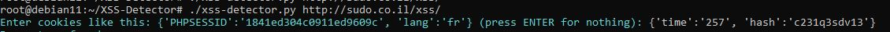
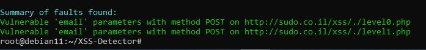

# XSS-Detector
An XSS website vulnerability scanner coded in Python3

This is a Python script that detects XSS flaws on your web pages.\
It is very easy to use.

## Python modules requierements:
* re
* requests
* sys
* ast

## Usage:
> chmod + x xss-detector.py\
> ./xss-detector.py http://example.fr

or 

> chmod + x xss-detector.py\
> python3 xss-detector.py http://example.fr

## Example:

